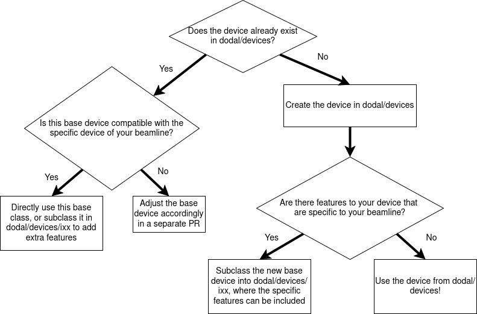

How to decide where to put your code
===========================

There are three broad options as to where to put a new piece of logic: EPICS, dodal, or your bluesky plan repository. To determine this part, think about which of the options best describe what is being added:

1. It only affects one device, is simple, won't change often, and/or is useful for scientists to be able to run outside of any DAQ framework. In this situation, it should go into EPICS. For example, zeroing a motor.

2. It only affects one device, is complicated, and may require frequent tweaking. This should go into dodal. For example, setting the undulator gap based on an energy input.

3. It affects multiple devices, is specific to an experiment, and may involve coordinating devices with external interactions. This should go into a bluesky plan repository. For example, moving a group of devices according to some user input.

4. It adds functionality which isn't specific to an experiment or a beamline, affects devices that are found on most beamlines, and is likely to be useful across science groups. In this case, it should go into dodal, as a plan in ``dodal/plans``. For example, a function to wait for top-up to complete using signals from the `Synchrotron` device.

The ophyd-async documentation also has a similar `section on this topic <https://blueskyproject.io/ophyd-async/main/explanations/where-device-logic.html>`_

But where in dodal?!
---------------------------

For devices, ideally, we would like every device which is used across different beamlines to have a base device in dodal/devices. If a beamline has a modified version of this device, they can subclass the base class into ``dodal/devices/ixx``. The base device should be the best attempt to contain the minimum signals + logic that any variation of that device might contain. See `BaseDCM` as an example here.

