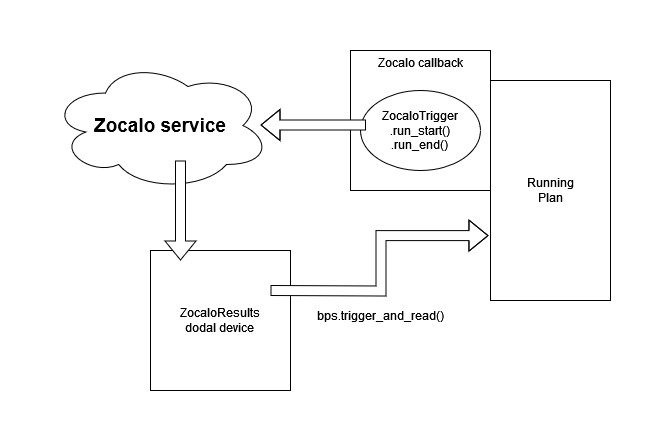

Zocalo Interaction
==================

Zocalo jobs are triggered based on their ISPyB DCID using the ``ZocaloTrigger`` class in a callback subscribed to the 
Bluesky plan or ``RunEngine``. These can trigger processing for any kind of job, as zocalo infers the necessary 
processing from data in ISPyB.

Results are received using the ``ZocaloResults`` device, so that they can be read into a plan and used for 
decision-making. Currently the ``ZocaloResults`` device is only made to handle X-ray centring results. It subscribes to 
a given zocalo RabbitMQ channel the first time that it is triggered.

Zocalo Service
==============

The Zocalo service processes incoming messages using recipes which describe routing of messages between processing 
steps. You can see `source for the recipes here`_.

.. _source for the recipes here: https://gitlab.diamond.ac.uk/scisoft/zocalo/-/tree/master/recipes

You can find more information about Zocalo at https://confluence.diamond.ac.uk/display/SSCC/How+to+create+an+MX+processing+pipeline

Gridscans
---------

The Zocalo Service receives messages of the following form for both the xy and xz gridscans::

    {
        'recipes': ['mimas'],
        'parameters': {
            'ispyb_dcid': 16085800,
            'filename': 'ins_10_31',
            'start_frame_index': 0,
            'number_of_frames': 1140,
            'message_index': 0,
            'event': 'start',
            'guid': 'd6f117bb-c856-4df8-b9bc-2d3c625e9fd5'
        }
    }

Zocalo is then sent stop messages::

   {
        'recipes': ['mimas'],
        'parameters': {
            'event': 'end',
            'ispyb_dcid': 16085800,
            'guid': '9a96e59c-da30-494c-8380-c7a5c828c2c9'
        },
   }

these tell zocalo that the data is now ready to be processed.

Zocalo then uses the ISPyB DataCollection ID to fetch the corresponding info from ISPyB

The messages that zocalo receives can be found in Graylog in the Zocalo stream, from there you can find the log of 
the recipe processing using the path to the logbook that comes from messages like these::
    Message saved in logbook at /dls/tmp/zocalo/dispatcher/2024-12/cb/62d35b-7cc9-4f1b-868b-712e82aa0271

From the zocalo graylog you can also see that once the gridscan nexus file is picked up (for the CPU gridscan) it 
starts a recipe::

    {'recipes': ['per-image-analysis-gridscan-i03-no-really'], 'parameters': {'ispyb_dcid': 16085803, 'filename': '{filename}', 'start_frame_index': '{start_frame_index}', 'number_of_frames': '{number_of_frames}', 'message_index': '{message_index}', 'guid': 'd10f8b8c-57a5-4dc4-acaf-a22f8d2bbf60'}, 'recipe': <workflows.recipe.recipe.Recipe object at 0x7f0587f13110>}

If you look at the recipe json, Zocalo then runs Per-Image-Analysis on each frame and then assembles the results in 
the `DLS X-Ray Centring service`_.

.. _DLS X-Ray Centring service: https://github.com/DiamondLightSource/python-dlstbx/blob/a8fcbd30335bf13f5e35df78badfc60397500535/src/dlstbx/services/xray_centering.py
