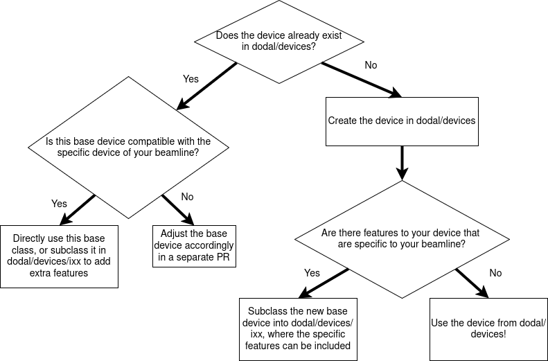

# Device Standards

## Ophyd vs Ophyd-async

Some devices have been written in ``ophyd`` for historic reasons. However, all new devices should be written in
``ophyd-async`` and any old ``ophyd`` devices undergoing a large re-write should be considered for
conversion to ``ophyd-async``.


## Where to put devices

Dodal is written with the philosophy that Ophyd devices should be assumed to be as generic as possible. I.e. you
should think about where to place them in the following order:

*  A device that could be used at any facility, e.g. a generic ``Motor`` or a commercial product with a
   standard IOC, should go in https://github.com/bluesky/ophyd-async
*  A device that may be on any beamline should go in the top level of the ``devices`` folder. If it is a quite
   complex device (e.g. multiple files) it should have a folder of its own e.g. ``oav``
*  A device that is very specific to a particular beamline should go in the ``devices/ixx`` folder

This is in an effort to avoid duplication across facilities/beamlines. You should also consider whether it is best for a piece of logic is better suited to the control system or a bluesky plan - see [ophyd-async's guide](https://blueskyproject.io/ophyd-async/main/explanations/where-device-logic.html) on that.

Determining where in dodal a device should live can be summarised below:



## Device Best Practices

In general, you should follow the ophyd-async [guide](https://blueskyproject.io/ophyd-async/main/how-to/choose-right-baseclass.html) for what interfaces a device should implement.
In addition to this the following guidelines are strongly recommended:

* Device should have their name as an optional str parameter with a default of ""- this allows ophyd-async to automatically name the device
* Devices should contain only the PV suffixes that are generic for any instance of the device. See [PV Suffixes](#pv-suffixes)
* Anything in a device that is expected to be set externally should be a signal. See [Use of signals](#use-of-signals)
* Devices should not hold state, when they are read they should read the hardware. See [Holding State](#holding-state)

## Defaulting Names

Device should provide the ability to override their name while maintaining a default name of ""-
this allows the device to be named on connection from the name of its factory function when using
the device_factory decorator.

When a device is named in this way, all of its child devices are named appropriately.

```python
    class MyDevice(Device):
        def __init__(self, prefix: str, name: str = "")
            x = Motor(prefix + "X")
            super().__init__(name)

    @device_factory()
    def foo() -> MyDevice:
        return MyDevice("FOO:")

    f = foo()
    f.name == "foo"
    f.x.name == "foo-x"
```

## PV Suffixes

In general devices should contain only the PV suffixes that are generic for any instance of the device e.g.

```python

    class MyDevice(Device):
        def __init__(self, prefix: str, name: str = "")
            self.bragg = Motor(prefix + "BRAGG")
            super().__init__(name)

    MyDevice("BLXXI-MO-DCM-01:")
```

is preferred over

```python

    class MyDevice(Device):
        def __init__(self, prefix: str, name: str = "")
            self.bragg = Motor(prefix + "-MO-DCM-01:BRAGG")
            super().__init__(name)

    MyDevice("BLXXI")
```

This is so that a new device on say ``-MO-DCM-02`` can be easily created.

## Beamline Prefix

Most devices have a beamline-specific prefix such as BL03I however some devices do not. In such cases when calling
`device_instantiation()` you can specify `bl_prefix=False` to ensure that the beamline prefix is not automatically
prepended.

## Use of signals

Anything in a device that is expected to be set externally e.g. by a plan should be a signal, even if it does not
connect to EPICS. If it does not connect to EPICS it should be a soft signal.

Whilst it would be possible to do:

```python

    class MyDevice(Device):
        def __init__(self):
             self.param = "blah"

    my_device = MyDevice()
    def my_plan():
        my_device.param = "new_value"
```

this has potential negative side effects:

* When the plan is simulated it will still set the parameter on the device
* There may be external things attached to the RE that are tracking messages e.g. metrics. A set like this would be
  lost

Instead you should make a soft signal:

```python

    class MyDevice(Device):
        def __init__(self):
             self.param = soft_signal_rw(str)

    my_device = MyDevice()
    def my_plan():
        yield from bps.mv(my_device.param, "new_value")
```


## Holding State

Devices should avoid holding state as much as possible. Ophyd devices are mostly trying to reflect the state of hardware and so when the device is read that hardware should be read.

If the device holds the state itself it is likely to not reflect the real hardware if:
* The device has just been initialised
* The hardware has changed independently e.g. via EPICS directly
* The hardware has failed to do what the device expected

For example, if I have a device that I would like to treat as moving in/out based on an underlying axis then it would be incorrect to implement it like this:

```python

    class InOut(Enum):
        IN = 0
        OUT = 0

    class MyDevice(Device):
        def __init__(self):
            self.underlying_motor = Motor("MOTOR")
            with self.add_children_as_readables():
                self.in_out, self._in_out_setter = soft_signal_r_and_setter(InOut)


        @AsyncStatus.wrap
        async def set(self, value: InOut):
            if value == InOut.IN:
                await self.underlying_motor.set(100)
            else:
                await self.underlying_motor.set(0)
            self._in_out_setter(value)
```

While this may appear to work fine during normal operation the state of in_out is only ever updated if the ophyd device is set. It is incorrect to assume that underlying_motor only changes
based on this and so this has the issues listed above. Instead you should make sure to update in_out whenever the device is read e.g.

```python

    class InOut(Enum):
        IN = 0
        OUT = 0

    class MyDevice(Device):
        def __init__(self):
            self.underlying_motor = Motor("MOTOR")
            with self.add_children_as_readables():
                self.in_out = derived_signal_r(self._get_in_out_from_hardware, current_position= self.underlying_motor)

        def _get_in_out_from_hardware(self, current_position:float)->InOut:
            if isclose(current_position, 0):
                return InOut.IN
            elif isclose(current_position, 100):
                return InOut.OUT
            else:
                raise ValueError()


        @AsyncStatus.wrap
        async def set(self, value: InOut):
            if value == InOut.IN:
                await self.underlying_motor.set(100)
            else:
                await self.underlying_motor.set(0)
```

For detail on how to use derived signal see [ophyd-async how to guide](https://blueskyproject.io/ophyd-async/main/how-to/derive-one-signal-from-others.html).
