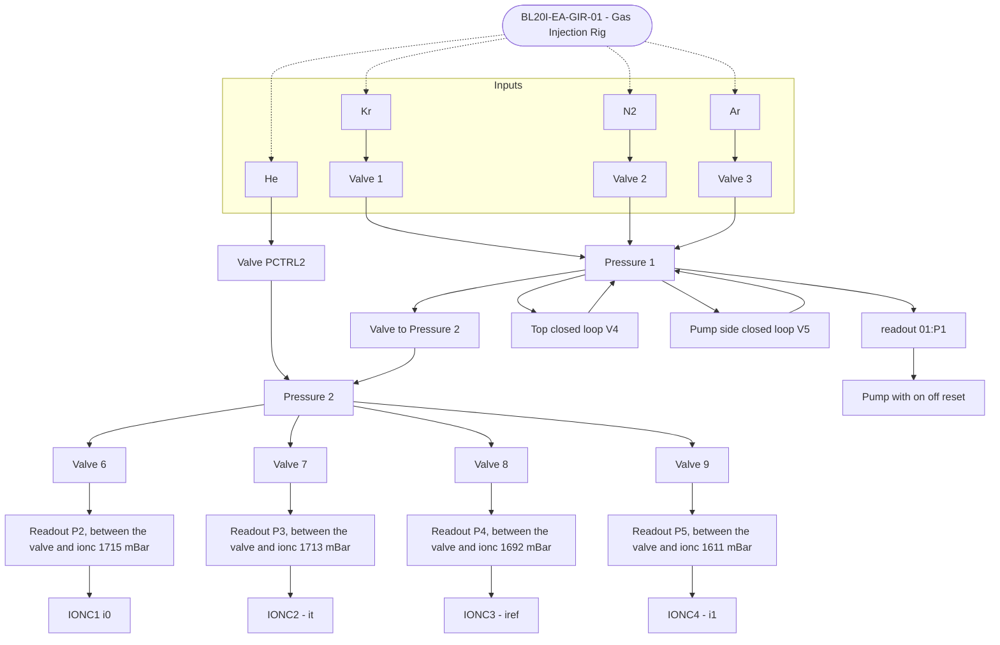

# Detectors

BL20I-EA-IAMP-01 = i0
04 = i1
02 = it
03 = iref

BL20I-EA-GIR-01:VACP1:CON is the pump - on, off, reset

## table

BL20I-EA-TABLE-02:X.VAL with x, y, sample rotation, fine rotation

also MO-Table-03 with 6 degrees of movement

t1 opticts table EA-01
with x, y

## diagram

scientifically we do small portion of the heavy gas to measure flux
we use the light gas (Helium) to make sure that the pressure is positive so that
we do not get air leak into the ion chamber.

